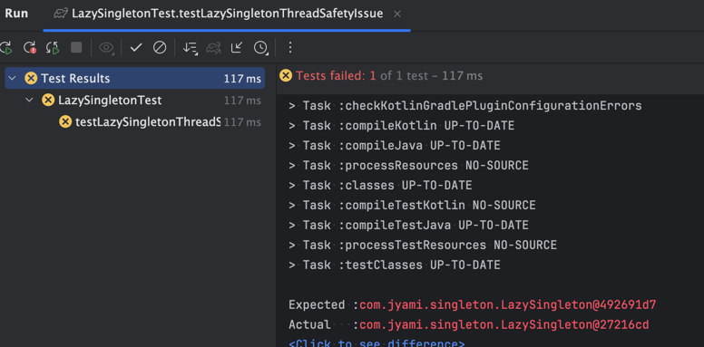

# Java에서 Singleton 객체를 만드는 방법

싱글턴(Singleton)은 애플리케이션에서 단 하나의 인스턴스만 존재하도록 보장하는 디자인 패턴입니다.
멀티스레드 환경에서도 안전하게 단일 인스턴스를 유지하는 방법을 알고 사용하는 것이 중요합니다.

## 1. public static final 필드 방식 (Eager Initialization Singleton)

“클래스가 로드될 때 단 한 번만 인스턴스를 생성하는 방식”

```java
public class EagerSingleton {
    public static final EagerSingleton INSTANCE = new EagerSingleton(); // 단 하나의 인스턴스

    private EagerSingleton() {} // 외부에서 인스턴스 생성 방지

    public void showMessage() {
        System.out.println("Eager Singleton Instance");
    }
}
```

- 장점
  - 구현이 매우 간단함.
  - 클래스가 로드될 때 한 번만 인스턴스가 생성됨.
  - final 키워드를 사용하여 변경 불가능한 단일 인스턴스 보장.

- 단점
  - 클래스가 로드될 때 무조건 인스턴스를 생성하기 때문에, 사용하지 않아도 메모리를 차지함.
  - Lazy Initialization(지연 초기화)이 불가능 → 처음부터 인스턴스를 만들어야 함.

## 2. private 생성자를 활용한 Singleton (Lazy Initialization Singleton)

“인스턴스를 필요할 때 처음 생성하는 방식”

```java
public class LazySingleton {
    private static LazySingleton instance; // 인스턴스 변수

    private LazySingleton() {} // 외부에서 생성 불가능

    public static LazySingleton getInstance() {
        if (instance == null) { // 최초 호출 시 인스턴스 생성
            instance = new LazySingleton();
        }
        return instance;
    }

    public void showMessage() {
        System.out.println("Lazy Singleton Instance");
    }
}
```
- 
- 장점
  - Lazy Initialization(지연 초기화) 가능 → 처음 사용할 때만 인스턴스 생성
  - 메모리 절약 (필요할 때만 객체가 생성됨)

- 단점
  - 멀티스레드 환경에서 동시 접근 시 두 개의 인스턴스가 생성될 위험이 있음 (동기화 필요).



## synchronized를 활용한 Thread-safe Singleton (멀티스레드 안전)

“멀티스레드 환경에서도 단일 인스턴스를 보장”

```java
public class ThreadSafeSingleton {
    private static ThreadSafeSingleton instance;

    private ThreadSafeSingleton() {}

    public static synchronized ThreadSafeSingleton getInstance() { // 동기화 추가
        if (instance == null) {
            instance = new ThreadSafeSingleton();
        }
        return instance;
    }

    public void showMessage() {
        System.out.println("Thread Safe Singleton Instance");
    }
}
```
- 장점 : 멀티스레드 환경에서도 안전하게 동작
- 단점 : synchronized 키워드로 인해 성능 저하 발생 가능


## Double-Checked Locking Singleton (더블 체크 락킹)

“인스턴스가 생성되지 않은 경우에만 동기화 수행”
멀티스레드 환경에서 불필요한 동기화 비용을 줄이면서도 단일 인스턴스를 보장한다.

```java
public class DoubleCheckedLockingSingleton {
    private static volatile DoubleCheckedLockingSingleton instance; // volatile 키워드 추가

    private DoubleCheckedLockingSingleton() {}

    public static DoubleCheckedLockingSingleton getInstance() {
        if (instance == null) {
            synchronized (DoubleCheckedLockingSingleton.class) {
                if (instance == null) {
                    instance = new DoubleCheckedLockingSingleton();
                }
            }
        }
        return instance;
    }

    public void showMessage() {
        System.out.println("Double-Checked Locking Singleton Instance");
    }
}
```
멀티스레드 환경에서 인스턴스의 가시성을 보장하여, 모든 스레드가 동일한 instance 값을 볼 수 있도록 보장합니다.


- 장점
  - 멀티스레드 환경에서도 성능 저하 없이 동작
  - 인스턴스가 생성되지 않은 경우에만 동기화 수행

### 참고 자료

#### volatile 키워드

정의: volatile 키워드는 변수를 CPU 캐시가 아닌 메인 메모리에서 읽고 쓰도록 강제하는 키워드입니다.

사용 이유:
- 멀티스레드 환경에서 하나의 쓰레드가 변경한 값을 다른 쓰레드가 즉시 볼 수 있도록 보장합니다.
- CPU가 값을 캐싱하여 각 쓰레드가 다른 값을 볼 가능성을 제거합니다.
- volatile 키워드는 변수의 가시성만 보장하며, 동기화는 보장하지 않습니다. 하나의 변수에 대한 변경 사항만 반영 가능합니다.


### synchronized 키워드

정의: synchronized는 멀티스레드 환경에서 특정 코드 블록 또는 메서드가 한 번에 하나의 쓰레드만 실행하도록 보장하는 키워드입니다.

사용이유 : 여러 스레드가 같은 메모리에 동시에 접근하여 **데이터 충돌(Race Condition)**이 발생하는 문제를 방지합니다.


## 선택
- 멀티스레드 환경이 아닐 경우 → Lazy Singleton 방식이 효율적
- 멀티스레드 환경이라면 → Thread-safe Singleton (synchronized 추가)
- 클래스가 로드될 때부터 객체가 필요하다면 → Eager Singleton 방식

